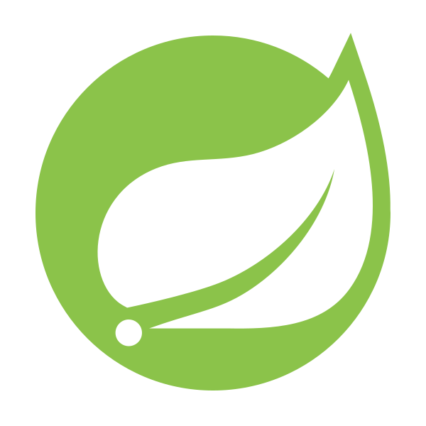
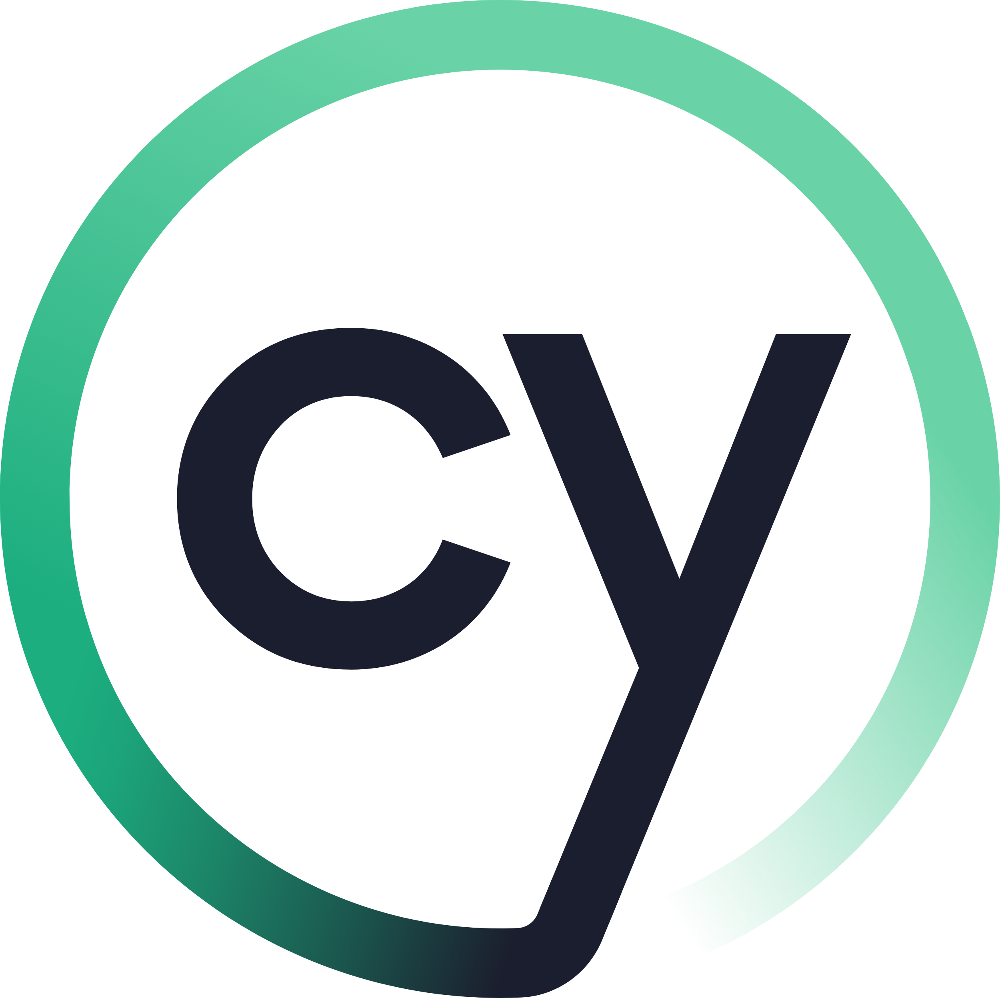
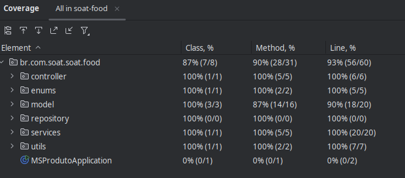

# Sistema para Lanchonete - Microsserviço de Produto

Este repositório contém a implementação de um dos microsserviços do sistema controle e autoatendimento de pedidos em lanchonete, desenvolvido como parte de um trabalho de Pós-graduação em Software Architecture. O projeto foi refatorado em microsserviços seguindo as boas práticas de arquitetura de software e os requisitos estabelecidos. 

## Estrutura do Sistema

O sistema foi dividido em três microsserviços principais, cada um com responsabilidade específica:

### **1. Pedido**
- Responsável pela gestão e acompanhamento do processo de produção de pedidos.
- Funcionalidades:
  - Registro de novos pedidos.
  - Retorno das informações para montagem de pedidos.
  - Listagem de pedidos registrados.
  - Gestão da fila de pedidos (visão da cozinha).
  - Atualização de status de cada etapa de produção.

### **2. Pagamento**
- Responsável pela gestão dos pagamentos dos pedidos.
- Funcionalidades:
  - Registro de solicitações de pagamento.
  - Atualização do status dos pedidos com base no retorno do processo de pagamento.

### **3. Produto**
- Responsável pela gestão do catálogo de produtos da lanchonete.
- Funcionalidades:
  - Registro e atualização de produtos no catálogo.
  - Consulta detalhada de informações sobre produtos.
  - Disponibilização de dados para outros serviços, como preços e descrições.

Cada microsserviço possui um banco de dados independente, garantindo isolamento e modularidade. Foi utilizado:
- **Banco de dados SQL** para o microsserviço **Produto**.
- **Banco de dados NoSQL** para os microsserviços **Pedido** e **Pagamento**.

## Tecnologias Utilizadas

- **Linguagens e Frameworks**:
  - Java </img> com Springboot </img> (desenvolvimento)
  - RabbitMQ (mensageria) </img>
- **API Gateway**: integração [[Link]](https://github.com/6SOATGP54/tech-challenge-api-gateway)
- **Bancos de Dados**: PostgreSQL </img> e MongoDB </img>
- **Ferramentas de CI/CD**: GitHub Actions </img>
- **Ferramentas de Testes**:
  - Cobertura de testes: 80% (mínimo) para todos os serviços com JUnit </img>.
  - BDD implementado em um dos caminhos de teste </img>.

## Regras de Desenvolvimento

1. **Estrutura de Branches**:
   - As branches `main` estão protegidas, não permitindo commits diretamente.
   - As branches `develop` contém as atualizações mais recentes de código.
   - Atualizações nas branches `main` são feitas por meio de Pull Requests.

2. **Validação Automática**:
   - O build da aplicação e a qualidade do código (mínimo de 70% de cobertura) são validados via SonarQube.

3. **Deploy Automatizado**:
   - O merge para a branch principal dispara o deploy automatizado de todos os microsserviços.

## Evidências de Cobertura de Testes

[img] Evidência de cobertura de testes para o microsserviço Pedido  
[img] Evidência de cobertura de testes para o microsserviço Pagamento

     Evidência de cobertura de testes para o microsserviço Produto</img>

Os links para as ferramentas utilizadas estão disponíveis na seção **Links dos Repositórios**.

## Demonstração

[img] Funcionamento da aplicação  
[img] Arquitetura do sistema refatorado  
[img] Pipeline de CI/CD em execução  

## Links dos Repositórios

- [Pedido](https://github.com/6SOATGP54/tech-challenge-ms-pedido)
- [Pagamento](https://github.com/6SOATGP54/tech-challenge-ms-pagamento)
- [Produto](https://github.com/6SOATGP54/tech-challenge-ms-produto)

Cada repositório contém:
- Código-fonte do microsserviço correspondente.
- Evidências de cobertura de testes no README.

## Acesso ao Código

Este projeto está configurado como privado. Para avaliação, o usuário **soat-architecture** foi adicionado com permissão de acesso.

## Contato

Grupo nº 54 da turma 6SOAT/2024 do curso lato sensu "Especialização em Arquitetura de Software" composto por:
- Bruno Matias
- Clederson Cruz
- Lucas Santiago